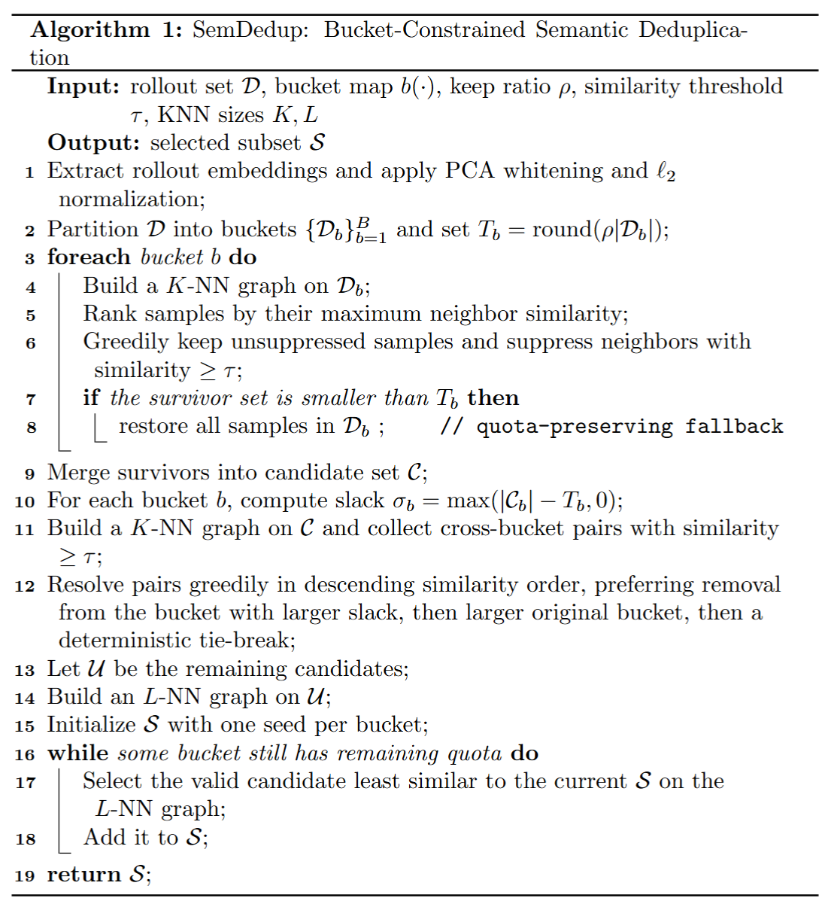

--------------------------------
**Supplementary Table 1.  VisualProcessBench results on InternVL3-14B.** The **10% subset selected by BIS** achieves performance comparable to **full-data training**.

| Method | Overall | MathVision | MathVerse | MMMU | DynaMath | WeMath |
|---|---:|---:|---:|---:|---:|---:|
| BIS-10%   | **66.05** | **67.39** | **66.34** | 62.65 | **66.41** | 64.21 |
| Full-Data | 65.80 | 66.87 | 66.23 | **63.75** | 65.37 | **64.31** |

--------------------------------



**Supplementary Table 2.  Evaluation on VisualProcessBench for InternVL2.5-8B with two additional baselines.**

| Method | Overall | MathVision | MathVerse | MMMU | DynaMath | WeMath |
|---|---:|---:|---:|---:|---:|---:|
| Average Stepwise 25% | 64.32 | 64.85 | 64.29 | 60.91 | 65.73 | 63.82 |
| Semdedup 25%         | 64.13 | 65.25 | 63.82 | 60.01 | 65.28 | 64.33 |
| BIS 25%              | **65.46** | **67.98** | 64.86 | 60.49 | 65.72 | **65.59** |
| Full-Data            | 65.12 | 65.77 | **65.43** | **61.84** | **66.17** | 63.56 |

--------------------------------

**Supplementary Table 3. InternVL2.5-B results from three different random seeds (mean ± std).**

| Method | Overall | MathVision | MathVerse | MMMU | DynaMath | WeMath |
|---|---:|---:|---:|---:|---:|---:|
| BIS-25% | 65.38 ± 0.13 | 67.39 ± 0.52 | 65.20 ± 0.30 | 60.25 ± 0.98 | 65.52 ± 0.19 | 65.69 ± 0.19 |
| Mix-25% | 64.37 ± 0.29 | 66.37 ± 0.17 | 64.34 ± 0.39 | 58.58 ± 0.12 | 65.40 ± 0.37 | 63.15 ± 1.18 |
| Δ | +1.01 | +1.03 | +0.86 | +1.67 | +0.12 | +2.54 |

--------------------------------

### Files
- `src/internvl/`: training code used in our experiments
- `configs/zero_stage3_config.json`: DeepSpeed config used as a reference
- `data/meta_visualprm400k.json`: meta file describing datasets
- `requirements.txt`: dependencies

### Main entry
- `src/internvl/train/internvl_chat_finetune.py`

### What the script needs
The training script expects:
- a pretrained checkpoint path (`--model_name_or_path`)
- a meta JSON that points to your local data (`--meta_path`)
- an output directory (`--output_dir`)
- optionally a DeepSpeed JSON (`--deepspeed`)


### Example training command
One way to call the script is:

```bash
python -m torch.distributed.run \
  --nproc_per_node=4 src/internvl/train/internvl_chat_finetune.py \
  --model_name_or_path /path/to/checkpoint \
  --meta_path data/meta_visualprm400k.json \
  --output_dir /path/to/output_dir \
  --deepspeed configs/zero_stage3_config.json \
  --conv_style internvl2_5
```

### Dataset meta JSON
The meta file maps dataset names to a small config. See `data/meta_visualprm400k.json`.

A small example:
```json
{
  "my_dataset": {
    "root": "/path/to/images",
    "annotation": "/path/to/ann.jsonl",
    "data_augment": false,
    "repeat_time": 1,
    "length": 12345
  }
}
```

### Evaluation
Evaluation scripts are under `eval/`. See `eval/README.md` for more details.

One example call:

```bash
python eval/prm/evaluate_visualprocessbench_prm.py \
  --checkpoint /path/to/checkpoint \
  --annotation /path/to/annotations.jsonl \
  --image-root /path/to/images \
  --out-dir /path/to/output_dir
```

